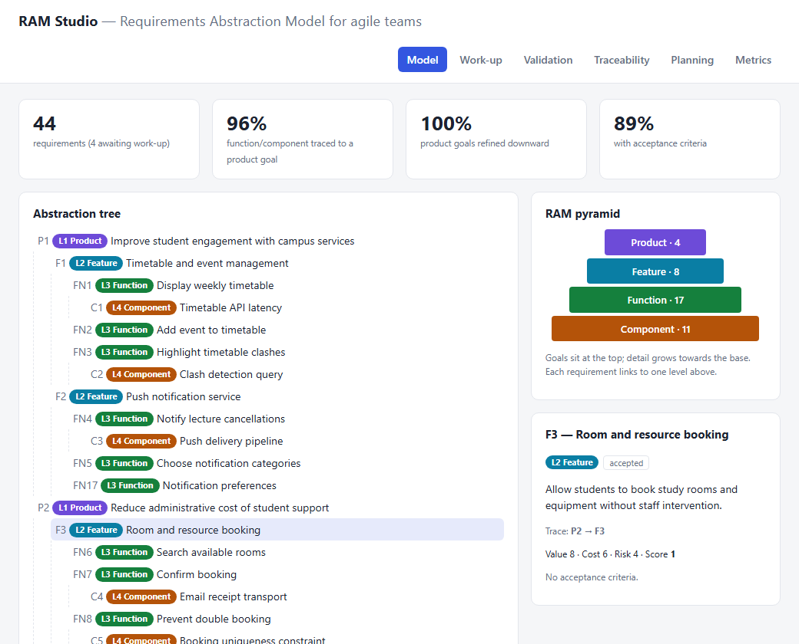
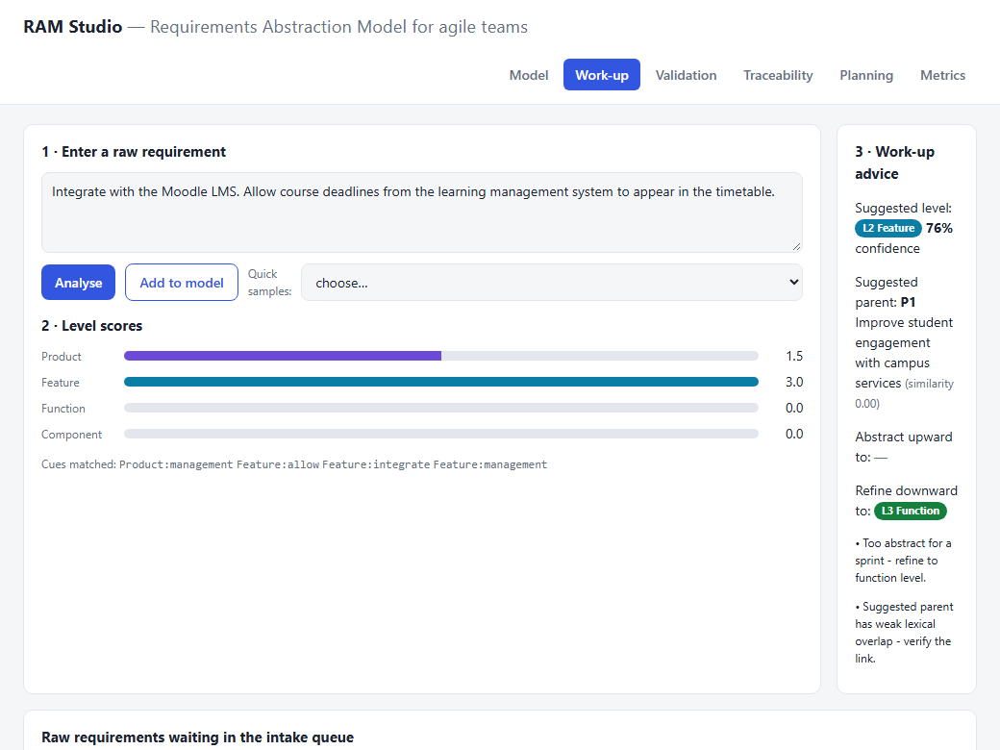
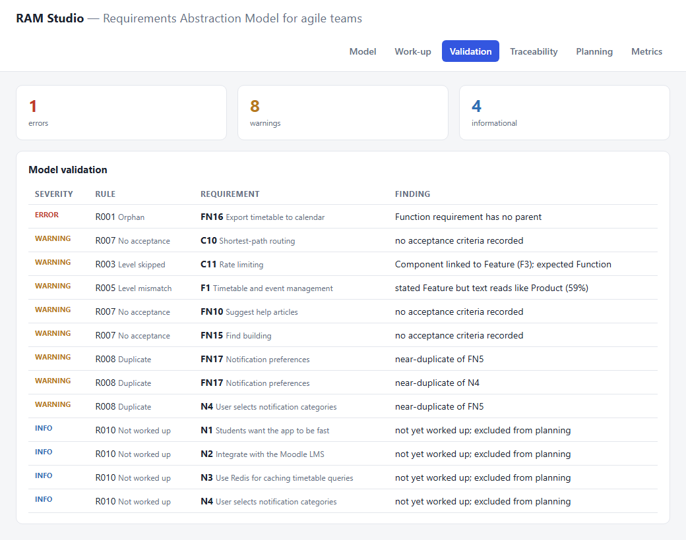
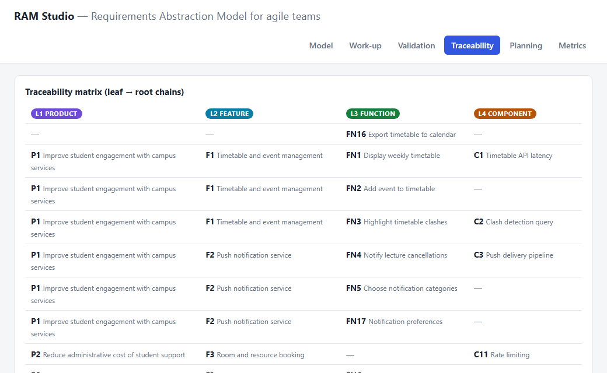
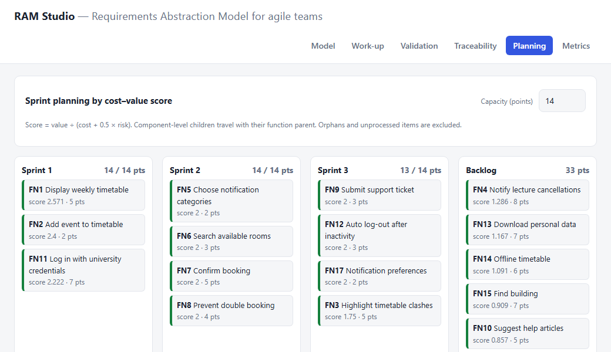

# Agile Requirements Abstraction Model (RAM Studio)

A small, dependency-free toolkit that operationalises the **Requirements Abstraction Model (RAM)**
of Gorschek & Wohlin (2006) for agile teams. It lets you keep product goals, features, user-story
level functions and technical constraints in **one traceable, validated model**, and turn the
result into a cost–value–ranked sprint plan.

* **Python library + CLI** (`ram/`) – data model, abstraction-level classifier, work-up engine,
  10-rule validator, traceability matrix, metrics and sprint planner. Standard library only.
* **RAM Studio web app** (`webapp/`) – a single-page app (no build step) that mirrors the engine
  in the browser: model tree, work-up advice, validation, traceability, sprint board, metrics.
* **Case study** (`examples/`) – *CampusConnect*, a university campus app with 44 requirements
  across all four levels, including deliberately seeded defects.
* **Academic report** (`report/RAM_Report.pdf`) – 15-page report with design, implementation,
  screenshots and evaluation.



## Why RAM for agile?

Agile backlogs tend to mix requirements of very different granularity: *"improve retention"* sits
next to *"return JSON in under 300 ms"*. RAM separates them into four abstraction levels and
insists that every requirement is **abstracted upward** until it connects to a product goal and
**refined downward** until a team can build it.

| Level | Name | Typical content | Agile counterpart |
|------:|------|-----------------|-------------------|
| L1 | **Product** | Goals and strategy | Product Goal / vision |
| L2 | **Feature** | Capabilities that realise goals | Epic / feature |
| L3 | **Function** | What a user can do, what the system does | User story / Product Backlog Item |
| L4 | **Component** | Measurable, design-near constraints | Acceptance criteria / NFR / technical task |

## Quick start

Requires Python 3.9+ (developed on 3.14). No packages to install.

```bash
git clone https://github.com/nakultt/agile-requirements-abstraction-model.git
cd agile-requirements-abstraction-model

python -m ram tree                 # abstraction tree of the sample model
python -m ram validate             # structural checks (R001–R010)
python -m ram matrix               # traceability matrix
python -m ram metrics              # coverage metrics
python -m ram rank                 # cost–value ranking of function-level requirements
python -m ram plan --capacity 14   # greedy sprint plan
python -m ram workup N2            # work-up advice for a raw requirement
python -m ram classify "The API shall return JSON in under 200 ms using an indexed table."
```

Use your own data with `-f my_requirements.json` (same schema as `examples/campusconnect.json`).

Web app: open `webapp/index.html` in a browser (or `python -m http.server -d webapp`).

Tests and evaluation:

```bash
python -m unittest discover -s tests -v   # 22 tests
python tools/evaluate.py                  # classifier accuracy on the labelled sets
```

## Features

### 1. Abstraction-level classifier
A transparent, weighted-lexicon classifier (`ram/lexicon.json`) assigns text to L1–L4 and reports
confidence plus the matched cues, so every decision can be explained and the lexicon tuned by a
team. The same lexicon file drives the Python and JavaScript implementations.

### 2. Work-up engine
For each raw requirement it suggests a level, the most similar parent one level up (Jaccard
similarity over stemmed tokens), which levels must still be **abstracted upward**, and which must
be **refined downward** before the item is sprint-ready.

### 3. Validator – rules R001–R010

| Rule | Severity | Finding |
|------|----------|---------|
| R001 | error | Non-product requirement has no parent (orphan) |
| R002 | error | Parent id does not exist |
| R003 | warning | Parent is not exactly one level above (level skipped/inverted) |
| R004 | error | Cycle in the parent chain |
| R005 | warning | Stated level disagrees with a confident classifier result |
| R006 | info | Product/feature without refinement below it |
| R007 | warning | Function/component lacks acceptance criteria |
| R008 | warning | Near-duplicate at the same level |
| R009 | warning | Empty or over-long title |
| R010 | info | Still in `new` status, outside the model |

### 4. Traceability, metrics and planning
* Leaf-to-root **traceability matrix** (Product → Feature → Function → Component).
* Coverage metrics: traceability, product refinement, acceptance-criteria coverage.
* **Priority score** `value / (cost + 0.5 × risk)` (cost–value approach, Karlsson & Ryan 1997).
* **Sprint planner**: greedy packing of function-level requirements by score; component children
  travel with their parent; orphans and unprocessed items are excluded.

## Screenshots

| Work-up | Validation |
|---|---|
|  |  |
| **Traceability** | **Sprint planning** |
|  |  |

## Evaluation summary

| Check | Result |
|-------|--------|
| Unit tests | 22 / 22 pass |
| Classifier – labelled set (48 statements, written alongside the lexicon) | 100 % accuracy (optimistic; not independent) |
| Classifier – held-out set (16 differently phrased statements, never used for tuning) | **50 % accuracy** – abstract product/feature wording is pushed to *Function* |
| Sample model (40 accepted requirements) | 95 % level agreement |
| Sample model coverage | traceability 96 %, product refinement 100 %, acceptance criteria 89 % |
| Seeded defects detected | orphan (R001), skipped level (R003), duplicate (R008) – all found |

The held-out result is reported deliberately: a lexicon-only classifier is an explainable
baseline, not a substitute for a trained model or human judgement. See the report for discussion.

## Project layout

```
ram/            Python package (model, classifier, workup, analysis, cli, lexicon.json)
webapp/         RAM Studio single-page app (index.html, generated data.js)
examples/       CampusConnect model + labelled / held-out classifier test sets
tests/          unittest suite
tools/          evaluate.py, make_figures.py, make_screenshots.py, build_web_data.py, build_report.py
docs/           screenshots, figures, evaluation.json
report/         15-page academic report (HTML source + PDF)
```

Regenerate artefacts: `python tools/build_web_data.py` (after editing the lexicon or sample),
`python tools/make_screenshots.py` (needs Edge/Chrome), `python tools/make_figures.py` and
`python tools/build_report.py` (need matplotlib, pypdf and Edge/Chrome).

## Limitations

* The classifier is lexical and English-only; unfamiliar vocabulary defaults to *Function*.
* The case study is synthetic – there has been no evaluation with real teams.
* Sprint planning is a greedy heuristic, ignores dependencies, and has no notion of velocity.

## References

Gorschek, T. & Wohlin, C. (2006). Requirements abstraction model. *Requirements Engineering*, 11(1), 79–101.
Karlsson, J. & Ryan, K. (1997). A cost-value approach for prioritizing requirements. *IEEE Software*, 14(5), 67–74.
Full list in the report.

## License

MIT – see [LICENSE](LICENSE).
